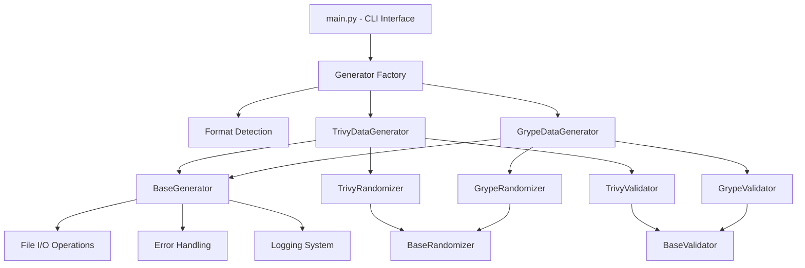
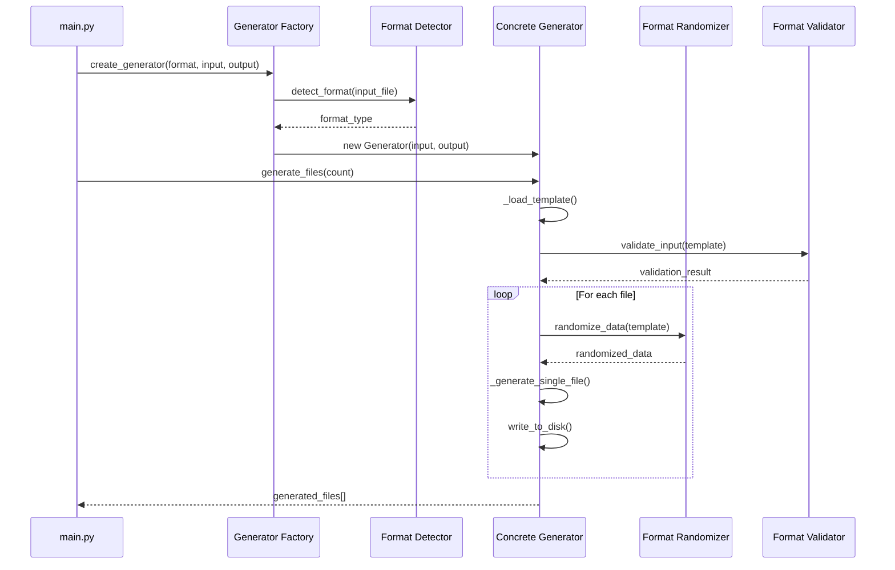
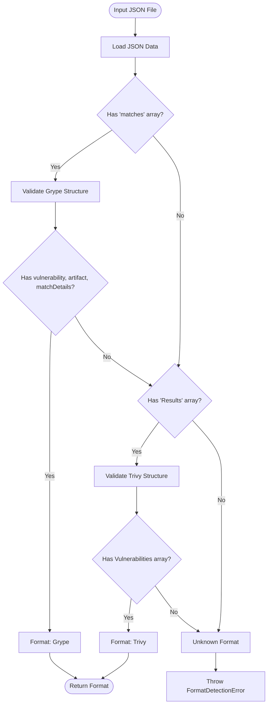

# Architecture Documentation

## Overview

The Vulnerability Test Data Generator follows a modular, extensible architecture built around the Template Method and Factory design patterns. The system supports multiple vulnerability scanner formats (currently Trivy and Grype) through a shared base class hierarchy that promotes code reuse and consistent behavior.

## Design Principles

### 1. Separation of Concerns
- **Generation Logic**: Template method pattern defines the workflow
- **Format-Specific Logic**: Concrete implementations handle scanner-specific details
- **Validation**: Separate validation classes for input/output verification
- **Randomization**: Dedicated randomizer classes for field-specific logic

### 2. Extensibility
- **Base Classes**: Abstract interfaces for easy extension to new formats
- **Factory Pattern**: Dynamic generator creation based on format detection
- **Plugin Architecture**: New scanner formats can be added without modifying existing code

### 3. Code Reuse
- **Shared Utilities**: Common randomization functions in base classes
- **Template Methods**: Consistent workflow across all formats
- **Error Handling**: Unified exception hierarchy and logging

## Architecture Diagram



## Core Components

### 1. Base Generator (base/generator.py)

The `BaseGenerator` class defines the template method pattern for file generation:

```python
class BaseGenerator(ABC):
    def generate_files(self, count: int) -> List[str]:
        """Template method - defines the workflow"""
        template = self._load_template()
        self._validate_input(template)
        
        generated_files = []
        for i in range(count):
            randomized_data = self._randomize_data(template.copy())
            filename = self._generate_single_file(randomized_data, i)
            generated_files.append(filename)
        
        return generated_files
    
    @abstractmethod
    def _randomize_data(self, data: Dict) -> Dict:
        """Format-specific randomization logic"""
        pass
    
    @abstractmethod
    def _validate_input(self, data: Dict) -> bool:
        """Format-specific validation logic"""
        pass
```

**Key Responsibilities:**
- Define the generation workflow (template method)
- Handle file I/O operations
- Manage error handling and logging
- Coordinate with randomizer and validator components

**Extension Points:**
- `_randomize_data()`: Implement format-specific randomization
- `_validate_input()`: Implement format-specific validation
- `_get_output_filename()`: Customize output file naming

### 2. Base Randomizer (base/randomizer.py)

The `BaseRandomizer` provides shared randomization utilities:

```python
class BaseRandomizer:
    def generate_cve_id(self) -> str:
        """Generate realistic CVE identifier"""
        year = random.choice(self.cve_years)
        number = random.randint(1000, 99999)
        return f"CVE-{year}-{number:05d}"
    
    def generate_version(self) -> str:
        """Generate realistic version string"""
        major = random.randint(1, 10)
        minor = random.randint(0, 20)
        patch = random.randint(0, 50)
        return f"{major}.{minor}.{patch}"
    
    def generate_cvss_score(self, min_score: float = 0.0, max_score: float = 10.0) -> float:
        """Generate realistic CVSS score"""
        return round(random.uniform(min_score, max_score), 1)
```

**Shared Utilities:**
- CVE ID generation with realistic year ranges
- Version string generation with semantic versioning
- CVSS score generation with proper ranges
- Date generation in various formats
- Hash generation for checksums and IDs

### 3. Base Validator (base/validator.py)

The `BaseValidator` provides validation template methods:

```python
class BaseValidator(ABC):
    def validate_input_file(self, file_path: str) -> bool:
        """Template method for input validation"""
        data = self._load_json(file_path)
        return self._validate_schema(data)
    
    @abstractmethod
    def _validate_schema(self, data: Dict) -> bool:
        """Format-specific schema validation"""
        pass
    
    @abstractmethod
    def _get_required_fields(self) -> List[str]:
        """Get required top-level fields"""
        pass
```

## Format-Specific Implementations

### Trivy Implementation

#### TrivyDataGenerator
- Extends `BaseGenerator`
- Implements Trivy-specific randomization workflow
- Handles `Results` array and `Vulnerabilities` structure

#### TrivyRandomizer
- Extends `BaseRandomizer`
- Randomizes Trivy-specific fields:
  - `ArtifactName` and `ImageID`
  - `VulnerabilityID`, `PkgName`, versions
  - `Severity` levels and CVSS scores
  - Date fields in Trivy format

#### TrivyValidator
- Extends `BaseValidator`
- Validates Trivy JSON schema
- Checks for required fields: `Results`, `Metadata`

### Grype Implementation

#### GrypeDataGenerator
- Extends `BaseGenerator`
- Implements Grype-specific randomization workflow
- Handles `matches` array and complex nested structures

#### GrypeRandomizer
- Extends `BaseRandomizer`
- Randomizes Grype-specific fields:
  - `matches` array (1-50 matches)
  - `vulnerability` objects with CVSS and EPSS data
  - `artifact` information with PURL format
  - `matchDetails` and `relatedVulnerabilities`

#### GrypeValidator
- Extends `BaseValidator`
- Validates Grype JSON schema
- Checks PURL format and CVSS structure
- Validates `matches` array requirements

## Class Interaction Flow

### File Generation Workflow



### Format Detection Process



## Adding New Scanner Formats

### Step-by-Step Guide

#### 1. Create Format Directory Structure
```
src/
└── newscanner/
    ├── __init__.py
    ├── generator.py
    ├── randomizers.py
    └── validators.py
```

#### 2. Implement Generator Class
```python
# src/newscanner/generator.py
from src.base.generator import BaseGenerator
from .randomizers import NewScannerRandomizer
from .validators import NewScannerValidator

class NewScannerDataGenerator(BaseGenerator):
    def __init__(self, input_file: str, output_dir: str):
        super().__init__(input_file, output_dir)
        self.randomizer = NewScannerRandomizer()
        self.validator = NewScannerValidator()
    
    def _randomize_data(self, data: Dict[str, Any]) -> Dict[str, Any]:
        """Implement scanner-specific randomization logic"""
        # Randomize root-level fields
        data['scanner_specific_field'] = self.randomizer.randomize_field()
        
        # Randomize nested structures
        if 'vulnerabilities' in data:
            data['vulnerabilities'] = self.randomizer.randomize_vulnerabilities(
                data['vulnerabilities']
            )
        
        return data
    
    def _validate_input(self, data: Dict[str, Any]) -> bool:
        """Validate input matches scanner format"""
        return self.validator.validate_input_file(data)
    
    def _get_output_filename(self, index: int) -> str:
        """Generate scanner-specific output filename"""
        return f"newscanner-generated-{index:04d}.json"
```

#### 3. Implement Randomizer Class
```python
# src/newscanner/randomizers.py
from src.base.randomizer import BaseRandomizer

class NewScannerRandomizer(BaseRandomizer):
    def __init__(self):
        super().__init__()
        # Scanner-specific data sources
        self.scanner_severities = ["CRITICAL", "HIGH", "MEDIUM", "LOW"]
        self.scanner_types = ["type1", "type2", "type3"]
    
    def randomize_vulnerabilities(self, vulnerabilities: List[Dict]) -> List[Dict]:
        """Randomize vulnerability array"""
        for vuln in vulnerabilities:
            vuln['id'] = self.generate_cve_id()
            vuln['severity'] = random.choice(self.scanner_severities)
            vuln['score'] = self.generate_cvss_score()
        return vulnerabilities
    
    def randomize_field(self) -> str:
        """Scanner-specific field randomization"""
        return f"scanner-{random.randint(1000, 9999)}"
```

#### 4. Implement Validator Class
```python
# src/newscanner/validators.py
from src.base.validator import BaseValidator

class NewScannerValidator(BaseValidator):
    def _validate_schema(self, data: Dict[str, Any]) -> bool:
        """Validate scanner-specific schema"""
        required_fields = self._get_required_fields()
        return all(field in data for field in required_fields)
    
    def _get_required_fields(self) -> List[str]:
        """Required top-level fields for this scanner"""
        return ["scanner_specific_field", "vulnerabilities", "metadata"]
```

#### 5. Update Format Detection
```python
# src/main.py - Add to detect_format function
def detect_format(file_path: str) -> str:
    with open(file_path, 'r') as f:
        data = json.load(f)
    
    # Existing Grype/Trivy detection...
    
    # Add new scanner detection
    if 'scanner_specific_field' in data and 'vulnerabilities' in data:
        return 'newscanner'
    
    raise FormatDetectionError("Unknown scanner format")
```

#### 6. Update Factory Method
```python
# src/main.py - Add to create_generator function
def create_generator(format_type: str, input_file: str, output_dir: str) -> BaseGenerator:
    if format_type == 'trivy':
        from src.trivy.generator import TrivyDataGenerator
        return TrivyDataGenerator(input_file, output_dir)
    elif format_type == 'grype':
        from src.grype.generator import GrypeDataGenerator
        return GrypeDataGenerator(input_file, output_dir)
    elif format_type == 'newscanner':
        from src.newscanner.generator import NewScannerDataGenerator
        return NewScannerDataGenerator(input_file, output_dir)
    else:
        raise ValueError(f"Unsupported format: {format_type}")
```

### Testing New Formats

#### 1. Create Test Files
```
tests/
├── test_newscanner_generator.py
├── test_newscanner_randomizers.py
├── test_newscanner_validators.py
└── fixtures/
    └── sample_newscanner.json
```

#### 2. Unit Tests Template
```python
# tests/test_newscanner_generator.py
import pytest
from src.newscanner.generator import NewScannerDataGenerator

class TestNewScannerGenerator:
    def test_randomize_data(self):
        """Test scanner-specific randomization"""
        generator = NewScannerDataGenerator("input.json", "output")
        # Test implementation
    
    def test_validate_input(self):
        """Test input validation"""
        # Test implementation
    
    def test_generate_files(self):
        """Test end-to-end file generation"""
        # Test implementation
```

#### 3. Integration Tests
```python
# tests/test_integration.py - Add new scanner tests
def test_newscanner_integration():
    """Test complete workflow with new scanner format"""
    # Test format detection
    # Test file generation
    # Test output validation
```

## Error Handling Architecture

### Exception Hierarchy
```python
class VulnerabilityGeneratorError(Exception):
    """Base exception for all generator errors"""

class FormatDetectionError(VulnerabilityGeneratorError):
    """Format detection failures"""

class ValidationError(VulnerabilityGeneratorError):
    """Input/output validation failures"""

class GenerationError(VulnerabilityGeneratorError):
    """File generation failures"""

class RandomizationError(VulnerabilityGeneratorError):
    """Data randomization failures"""
```

### Error Handling Strategy
1. **Input Validation**: Validate format and schema before processing
2. **Graceful Degradation**: Continue processing when possible, log warnings
3. **Detailed Logging**: Provide context for debugging and troubleshooting
4. **User-Friendly Messages**: Clear error messages with suggested solutions

## Performance Considerations

### Memory Management
- **Template Caching**: Cache parsed JSON templates to avoid repeated parsing
- **Deep Copy Optimization**: Efficient copying of complex nested structures
- **Garbage Collection**: Explicit cleanup of large data structures

### I/O Optimization
- **Batch Writing**: Group file write operations when possible
- **Async I/O**: Future enhancement for concurrent file generation
- **Progress Tracking**: Real-time progress updates for large batch operations

### Scalability
- **Memory Profiling**: Monitor memory usage during large batch generation
- **Performance Benchmarks**: Automated performance testing in CI/CD
- **Resource Limits**: Configurable limits for memory and file count

## Future Enhancements

### Planned Features
1. **Parallel Processing**: Multi-threaded file generation
2. **Configuration Files**: External configuration for randomization rules
3. **Plugin System**: Dynamic loading of scanner format plugins
4. **Output Formats**: Support for multiple output formats (YAML, XML)
5. **Streaming Processing**: Handle very large input files efficiently

### Extension Points
1. **Custom Randomizers**: User-defined randomization functions
2. **Validation Rules**: Configurable validation rules per format
3. **Output Templates**: Customizable output file templates
4. **Data Sources**: External data sources for realistic randomization

## Best Practices for Contributors

### Code Organization
- Follow the established package structure
- Use abstract base classes for shared interfaces
- Implement comprehensive error handling
- Add detailed docstrings and type hints

### Testing Requirements
- Unit tests for all public methods
- Integration tests for end-to-end workflows
- Performance tests for generation speed
- Test with realistic sample data

### Documentation Standards
- Update architecture documentation for new formats
- Add usage examples to README
- Document any new configuration options
- Include troubleshooting guides for common issues